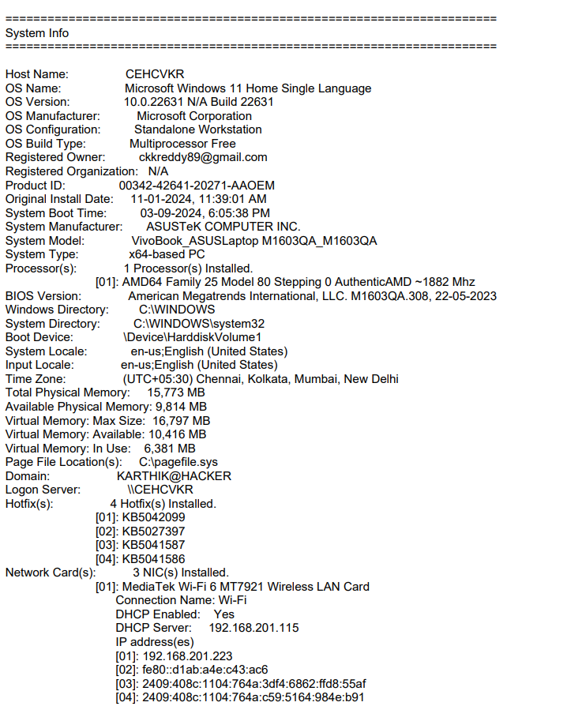

# Agent-less Vulnerabilities and Network Scanning

## Description

This project aims to develop an agent-less batch script tool to detect and scan for system and network vulnerabilities in Windows OS. The script is currently under development, and `vuln.txt` is a basic output example.

### Problem Statement

**Background**: It has been observed that most individuals are hasty when it comes to upgrading or updating their Windows systems to mitigate any adversary actions. Henceforth, a system vulnerability detector and scanner should be in place to audit and verify the system and network-based vulnerabilities (if they exist) to rectify the misconfigurations and mitigate any prominent threats to the individual or organization.

**Description**: The above problem statement envisions a blue team approach to identify and map potential vulnerabilities of a Windows OS subsystem to better secure and mitigate against various threats (System Level and Network Level).

### Expected Solution

The solution should provide possible vulnerabilities of the underlying Windows OS and must be AV/EDR friendly with an agent-less mechanism. It should be able to search and crawl for related available open-source exploits and their patches.

#### Key Information to be Identified

**System Information**:
- Basic OS info
- DotNet versions
- Providers registered for AMSI
- Registered antivirus (via WMI)
- Classic and Advanced audit policy settings present in registry keys
- Auto run executable/scripts/programs
- Standard and Non-standard firewall rules
- Windows Defender settings
- User and machine personal certificate files
- Current environment PATH folders, environment variables, and SDDL information
- Lists files/folders (by default, lists users' downloads, documents, and desktop folders)
- Information about a file (version information, AMSIProviders registered for AMSI)
- Installed hotfixes (via WMI)
- Installed products via the registry
- Local Group Policy settings applied to the machine/local users
- Non-empty local groups, displays all groups
- Local users, whether they're active/disabled
- All Microsoft updates (via COM, WMI)
- NTLM authentication settings
- Saved RDP connections stored in the registry
- Current incoming RDP sessions
- Remote Desktop Server/Client Settings
- Secure Boot configuration
- Sysmon configuration from the registry
- UAC system policies via the registry
- Windows Defender settings (including exclusion locations)
- Searches PowerShell console history files for sensitive regex matches

**Network Information**:
- Lists the current ARP table and adapter information
- DNS cache entries (via WMI)
- Windows network profiles
- Network shares exposed by the machine
- Current TCP and UDP connections and their associated processes and services
- Current RPC endpoints mapped
- Open ports status

**Additional Network Level Information**:
- System interface connectors
- LLDP / CDP connections (to infrastructure devices)
- Attached network vectors (systems connected within the VLAN)
- Capability to formulate a network diagram using this information

### Compatibility

- Should work with the latest Windows 10/11 builds.
- Should be able to consolidate its findings into a report file (PDF and/or HTML format).

## Example Output


................................................................................................. 
Installed Software with Unknown Publisher 
................................................................................................. 
  
There are no vulnerable software 
  
------------------------------------------------------------------------------------------------------------- 
  
................................................................................................. 
ARP Table 
................................................................................................. 
  

Interface: 192.168.201.223 --- 0xc
  Internet Address      Physical Address      Type
  192.168.201.115       c6-82-1c-c7-f4-3a     dynamic   
  192.168.201.255       ff-ff-ff-ff-ff-ff     static    
  224.0.0.2             01-00-5e-00-00-02     static    
  224.0.0.22            01-00-5e-00-00-16     static    
  224.0.0.251           01-00-5e-00-00-fb     static    
  224.0.0.252           01-00-5e-00-00-fc     static    
  239.255.255.250       01-00-5e-7f-ff-fa     static    
  255.255.255.255       ff-ff-ff-ff-ff-ff     static    

Interface: 192.168.137.1 --- 0xf
  Internet Address      Physical Address      Type
  192.168.137.255       ff-ff-ff-ff-ff-ff     static    
  224.0.0.2             01-00-5e-00-00-02     static    
  224.0.0.22            01-00-5e-00-00-16     static    
  224.0.0.251           01-00-5e-00-00-fb     static    
  224.0.0.252           01-00-5e-00-00-fc     static    
  239.255.255.250       01-00-5e-7f-ff-fa     static    

Interface: 192.168.217.1 --- 0x15
  Internet Address      Physical Address      Type
  192.168.217.255       ff-ff-ff-ff-ff-ff     static    
  224.0.0.2             01-00-5e-00-00-02     static    
  224.0.0.22            01-00-5e-00-00-16     static    
  224.0.0.251           01-00-5e-00-00-fb     static    
  224.0.0.252           01-00-5e-00-00-fc     static    
  239.255.255.250       01-00-5e-7f-ff-fa     static    

Windows IP Configuration

   Host Name . . . . . . . . . . . . : CEHCVKR
   Primary Dns Suffix  . . . . . . . : 
   Node Type . . . . . . . . . . . . : Mixed
   IP Routing Enabled. . . . . . . . : No
   WINS Proxy Enabled. . . . . . . . : No

Wireless LAN adapter Local Area Connection* 1:

   Media State . . . . . . . . . . . : Media disconnected
   Connection-specific DNS Suffix  . : 
   Description . . . . . . . . . . . : Microsoft Wi-Fi Direct Virtual Adapter
   Physical Address. . . . . . . . . : 52-5A-65-F7-B0-29
   DHCP Enabled. . . . . . . . . . . : Yes
   Autoconfiguration Enabled . . . . : Yes

Wireless LAN adapter Local Area Connection* 2:

   Media State . . . . . . . . . . . : Media disconnected
   Connection-specific DNS Suffix  . : 
   Description . . . . . . . . . . . : Microsoft Wi-Fi Direct Virtual Adapter #2
   Physical Address. . . . . . . . . : 52-5A-65-F7-B0-39
   DHCP Enabled. . . . . . . . . . . : Yes
   Autoconfiguration Enabled . . . . : Yes

Ethernet adapter VMware Network Adapter VMnet1:

   Connection-specific DNS Suffix  . : 
   Description . . . . . . . . . . . : VMware Virtual Ethernet Adapter for VMnet1
   Physical Address. . . . . . . . . : 00-50-56-C0-00-01
   DHCP Enabled. . . . . . . . . . . : No
   Autoconfiguration Enabled . . . . : Yes
   Link-local IPv6 Address . . . . . : fe80::4da0:4313:d5e1:c6fd%21(Preferred) 
   IPv4 Address. . . . . . . . . . . : 192.168.217.1(Preferred) 
   Subnet Mask . . . . . . . . . . . : 255.255.255.0
   Default Gateway . . . . . . . . . : 
   DHCPv6 IAID . . . . . . . . . . . : 503337046
   DHCPv6 Client DUID. . . . . . . . : 00-01-00-01-2D-31-3E-26-50-5A-65-F7-B0-29
   NetBIOS over Tcpip. . . . . . . . : Enabled

Ethernet adapter VMware Network Adapter VMnet8:

   Connection-specific DNS Suffix  . : 
   Description . . . . . . . . . . . : VMware Virtual Ethernet Adapter for VMnet8
   Physical Address. . . . . . . . . : 00-50-56-C0-00-08
   DHCP Enabled. . . . . . . . . . . : No
   Autoconfiguration Enabled . . . . : Yes
   Link-local IPv6 Address . . . . . : fe80::3633:6cb:c186:a521%15(Preferred) 
   IPv4 Address. . . . . . . . . . . : 192.168.137.1(Preferred) 
   Subnet Mask . . . . . . . . . . . : 255.255.255.0
   Default Gateway . . . . . . . . . : 
   DHCPv6 IAID . . . . . . . . . . . : 587223126
   DHCPv6 Client DUID. . . . . . . . : 00-01-00-01-2D-31-3E-26-50-5A-65-F7-B0-29
   NetBIOS over Tcpip. . . . . . . . : Enabled

Wireless LAN adapter Wi-Fi:

   Connection-specific DNS Suffix  . : 
   Description . . . . . . . . . . . : MediaTek Wi-Fi 6 MT7921 Wireless LAN Card
   Physical Address. . . . . . . . . : 50-5A-65-F7-B0-29
   DHCP Enabled. . . . . . . . . . . : Yes
   Autoconfiguration Enabled . . . . : Yes
   IPv6 Address. . . . . . . . . . . : 2409:408c:1104:764a:c59:5164:984e:b91(Preferred) 
   Temporary IPv6 Address. . . . . . : 2409:408c:1104:764a:3df4:6862:ffd8:55af(Preferred) 
   Link-local IPv6 Address . . . . . : fe80::d1ab:a4e:c43:ac6%12(Preferred) 
   IPv4 Address. . . . . . . . . . . : 192.168.201.223(Preferred) 
   Subnet Mask . . . . . . . . . . . : 255.255.255.0
   Lease Obtained. . . . . . . . . . : Wednesday, September 11, 2024 11:09:53 AM
   Lease Expires . . . . . . . . . . : Wednesday, September 11, 2024 12:09:53 PM
   Default Gateway . . . . . . . . . : fe80::c482:1cff:fec7:f43a%12
                                       192.168.201.115
   DHCP Server . . . . . . . . . . . : 192.168.201.115
   DHCPv6 IAID . . . . . . . . . . . : 122706533
   DHCPv6 Client DUID. . . . . . . . : 00-01-00-01-2D-31-3E-26-50-5A-65-F7-B0-29
   DNS Servers . . . . . . . . . . . : 192.168.201.115
   NetBIOS over Tcpip. . . . . . . . : Enabled
  
------------------------------------------------------------------------------------------------------------- 
  
................................................................................................. 
DNS cache entries 
................................................................................................. 
  

## Usage

To run the script, simply execute it on a Windows machine. Ensure you have the necessary permissions to run system commands.

```bash
C:\Users\ADMIN\ALVNS.bat
